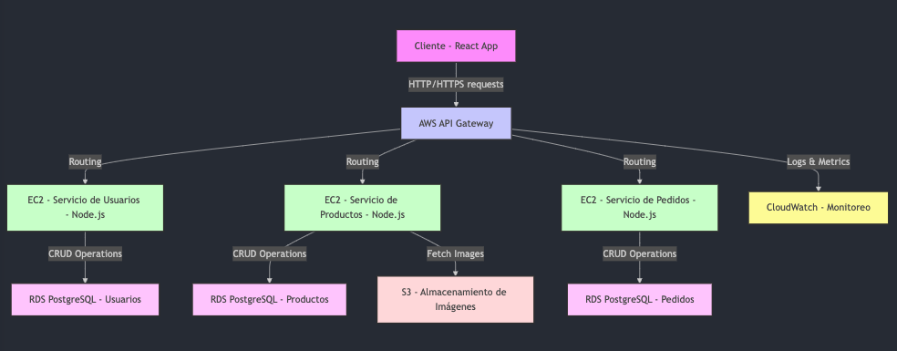
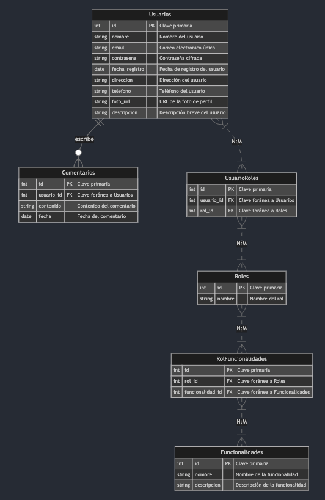
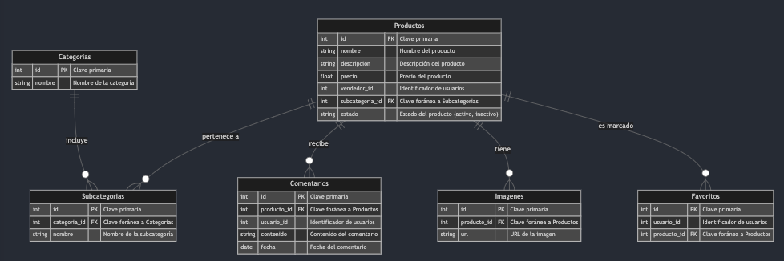
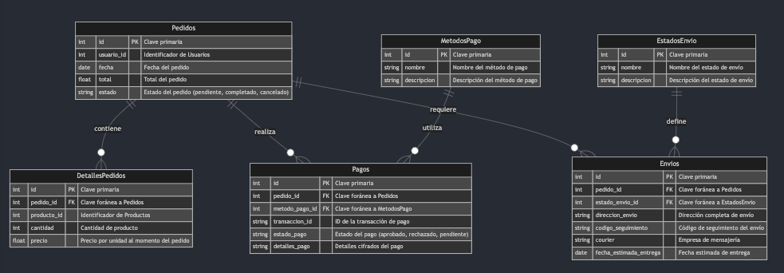

## Índice

0. [Ficha del proyecto](#0-ficha-del-proyecto)
1. [Descripción general del producto](#1-descripción-general-del-producto)
2. [Arquitectura del sistema](#2-arquitectura-del-sistema)
3. [Modelo de datos](#3-modelo-de-datos)
4. [Especificación de la API](#4-especificación-de-la-api)
5. [Historias de usuario](#5-historias-de-usuario)
6. [Tickets de trabajo](#6-tickets-de-trabajo)
7. [Pull requests](#7-pull-requests)

---

## 0. Ficha del proyecto

### **0.1. Tu nombre completo:** 
***German Bejarano Martinez***

### **0.2. Nombre del proyecto:**
***ArtiMark (Artisan Marketplace)***

### **0.3. Descripción breve del proyecto:**

El proyecto consiste en la creación de una plataforma marketplace unificada dedicada a artesanos, artistas y proveedores de insumos de arte. La plataforma permite la venta de productos hechos a mano, la adquisición de materiales, y la colaboración entre usuarios para crear proyectos artísticos únicos.

Esta plataforma marketplace está diseñada para convertirse en un hub centralizado para la comunidad artística, donde artesanos y artistas pueden exhibir y vender sus creaciones, aceptar encargos personalizados, y conectarse con proveedores de insumos para adquirir los materiales necesarios para sus obras. Además, la plataforma fomenta la colaboración entre artistas y proveedores, permitiendo que ambos trabajen juntos en proyectos que maximicen su creatividad y visibilidad.

### **0.4. URL del proyecto:**

> Puede ser pública o privada, en cuyo caso deberás compartir los accesos de manera segura. Puedes enviarlos a [alvaro@lidr.co](mailto:alvaro@lidr.co) usando algún servicio como [onetimesecret](https://onetimesecret.com/).

### 0.5. URL o archivo comprimido del repositorio

> Puedes tenerlo alojado en público o en privado, en cuyo caso deberás compartir los accesos de manera segura. Puedes enviarlos a [alvaro@lidr.co](mailto:alvaro@lidr.co) usando algún servicio como [onetimesecret](https://onetimesecret.com/). También puedes compartir por correo un archivo zip con el contenido


---

## 1. Descripción general del producto

### **1.1. Objetivo:**

Desarrollar y lanzar una versión mínima viable (MVP) del marketplace que permita a los usuarios finales explorar y adquirir productos de artistas y proveedores de arte.

### **1.1.1 Objetivos específicos:**
- Desarrollar una interfaz de usuario básica para que los usuarios finales puedan navegar por el catálogo de productos, buscar artículos específicos y realizar compras en la plataforma.
  
- Recopilar y analizar retroalimentación de los usuarios finales sobre la experiencia de uso de la plataforma para identificar áreas de mejora y validar el interés del mercado en la propuesta de valor ofrecida.


### **1.2. Características y funcionalidades principales:**

1. **Perfiles de Usuario**:
   - Registro y autenticación: Permitir a los usuarios registrarse e iniciar sesión.
   - Gestión de perfil: Habilitar a los usuarios para editar su información personal y ver su historial de compras.
  
2. **Gestión de Productos**:
   - Carga manual de productos: Implementa una funcionalidad que permita a los administradores cargar productos en la base de datos a partir de archivos Excel recibidos por correo electrónico. Esto incluye detalles como nombre del producto, descripción, precio, categoría y url de la imagen.
   - Visualización de productos: Facilitar a los usuarios la navegación por el catálogo, visualización de detalles de productos y búsqueda específica.
   
3. **Compra de Productos**:
   - Carrito de compras: Implementar un carrito para que los usuarios agreguen productos y gestionen su pedido.
   - Sistema de pagos: Integrar un sistema de pagos para procesar transacciones de compra.
  
4. **Feedback de Usuarios**:
   - Establecer métodos para que los usuarios proporcionen feedback sobre su experiencia.

---

## 2. Arquitectura del Sistema

### **2.1. Diagrama de arquitectura:**

Para el proyecto **ArtiMark** utilizara una arquitectura de microservicios, esta arquitectura se adecua mejor a este proyecto ya que nos permite tener un sistema distribuido y escalable, ademas de que nos permite tener un alto grado de desacoplamiento entre los servicios, lo cual nos permite tener un mayor control sobre el sistema y una mayor flexibilidad para el desarrollo de nuevas funcionalidades.

- **Características Principales**:
  - **Desacoplamiento**: Los servicios son independientes entre sí, lo que permite actualizar, escalar o depurar cada servicio de forma individual sin afectar a los demás.
  - **Especialización**: Cada microservicio se enfoca en una tarea específica (gestión de usuarios, manejo de productos, procesamiento de pagos, etc.), lo que mejora la organización y la claridad del código.
  - **Escalabilidad**: Los microservicios pueden escalarse horizontalmente de manera independiente según la demanda de cada servicio, lo que es ideal para un marketplace donde algunas áreas pueden experimentar más tráfico que otras.

- **Beneficios**:
  - **Flexibilidad Tecnológica**: Cada microservicio puede ser desarrollado utilizando el stack tecnológico que mejor se adapte a sus necesidades.
  - **Resiliencia**: Si un servicio falla, los demás pueden continuar funcionando, lo que mejora la disponibilidad general del sistema.
  - **Despliegue Continuo**: Permite la integración y despliegue continuos (CI/CD), facilitando actualizaciones rápidas y frecuentes sin tiempo de inactividad.

- **Consideraciones**:
  - **Complejidad de Gestión**: La arquitectura de microservicios puede ser más compleja de monitorear y gestionar debido a la cantidad de servicios independientes.
  - **Consistencia de Datos**: Es necesario implementar estrategias efectivas para manejar la consistencia de datos entre servicios, como el uso de bases de datos distribuidas o patrones de diseño específicos (por ejemplo, Saga).

- **Diagrama de arquitectura:**
  
  
  ```mermaid
  graph TD;
    Cliente[Cliente - React App]
    APIGateway[AWS API Gateway]

    ServicioUsuarios[EC2 - Servicio de Usuarios - Node.js]
    ServicioProductos[EC2 - Servicio de Productos - Node.js]
    ServicioPedidos[EC2 - Servicio de Pedidos - Node.js]
    RDSUsuarios[RDS PostgreSQL - Usuarios]
    RDSProductos[RDS PostgreSQL - Productos]
    RDSPedidos[RDS PostgreSQL - Pedidos]
    S3[S3 - Almacenamiento de Imágenes]
    CloudWatch[CloudWatch - Monitoreo]
    
    Cliente -->|HTTP/HTTPS requests| APIGateway
    APIGateway -->|Routing| ServicioUsuarios
    APIGateway -->|Routing| ServicioProductos
    APIGateway -->|Routing| ServicioPedidos
    APIGateway -->|Logs & Metrics| CloudWatch
    
    ServicioUsuarios -->|CRUD Operations| RDSUsuarios
    ServicioProductos -->|CRUD Operations| RDSProductos
    ServicioPedidos -->|CRUD Operations| RDSPedidos

    ServicioProductos -->|Fetch Images| S3
   
    style Cliente fill:#f9f,stroke:#333,stroke-width:2px,color:#515151
    style APIGateway fill:#ccf,stroke:#333,stroke-width:2px,color:#515151
    style ServicioUsuarios fill:#cfc,stroke:#333,stroke-width:2px,color:#515151
    style ServicioProductos fill:#cfc,stroke:#333,stroke-width:2px,color:#515151
    style ServicioPedidos fill:#cfc,stroke:#333,stroke-width:2px,color:#515151
    style RDSUsuarios fill:#fcf,stroke:#333,stroke-width:2px,color:#515151
    style RDSProductos fill:#fcf,stroke:#333,stroke-width:2px,color:#515151
    style RDSPedidos fill:#fcf,stroke:#333,stroke-width:2px,color:#515151
    style S3 fill:#fdd,stroke:#333,stroke-width:2px,color:#515151
    style CloudWatch fill:#fdfd96,stroke:#333,stroke-width:2px,color:#515151
  ```


### **2.2. Descripción de componentes principales:**

1. **Cliente - React App**
   - **Tecnología:** React.js
   - **Descripción:** Interfaz de usuario desarrollada en React, un framework de JavaScript para construir interfaces de usuario dinámicas y reactivas. El cliente interactúa con los servicios backend a través de solicitudes HTTP/HTTPS.
  
2. **AWS API Gateway**
   - **Tecnología:** AWS API Gateway
   - **Descripción:** Un servicio gestionado que facilita la creación, publicación, mantenimiento, monitoreo y protección de APIs a cualquier escala. Actúa como el punto de entrada para todas las solicitudes entrantes y se encarga del enrutamiento, la autenticación y la autorización.

3. **Servicios de Backend - Node.js**
   - **Tecnología:** Node.js
   - **Descripción:** Cada microservicio se desplegara en una instancia EC2, los microservicios se desarrollan en Node.js, un entorno de ejecución de JavaScript del lado del servidor que es ligero y eficiente, ideal para construir microservicios debido a su naturaleza asincrónica y orientada a eventos.

4. **Amazon RDS PostgreSQL**
   - **Tecnología:** Amazon RDS para PostgreSQL
   - **Descripción:** Un servicio de base de datos relacional que facilita la configuración, operación y escalado de bases de datos PostgreSQL en la nube, ofreciendo escalabilidad, alta disponibilidad y seguridad.

5. **Amazon S3**
   - **Tecnología:** Amazon Simple Storage Service (S3)
   - **Descripción:** Servicio de almacenamiento de objetos que ofrece escalabilidad, seguridad de datos, alta disponibilidad y rendimiento. En este proyecto, se utiliza para almacenar imágenes y otros archivos estáticos.

6. **Amazon CloudWatch**
   - **Tecnología:** Amazon CloudWatch
   - **Descripción:** Proporciona datos y análisis observables para monitorear aplicaciones, responder a cambios en el sistema y optimizar la eficiencia de la aplicación. Utilizado para monitorear y registrar métricas y logs de los servicios y contenedores.

---

## 3. Modelo de Datos

### **3.1. Diagrama del modelo de datos:**

- **Base de datos de Usuarios**

   
   ```mermaid
   erDiagram

      %% Definición de la base de datos de Usuarios
      Usuarios ||--o{ Comentarios : escribe
      Usuarios  }|..|{ UsuarioRoles : "N:M"
      Usuarios ||--o{ Comentarios : escribe
      UsuarioRoles }|..|{ Roles : "N:M"
      Roles  }|..|{ RolFuncionalidades : "N:M"
      RolFuncionalidades  }|..|{ Funcionalidades : "N:M"


      Usuarios {
         int id PK "Clave primaria"
         string nombre "Nombre del usuario"
         string email "Correo electrónico único"
         string contrasena "Contraseña cifrada"
         date fecha_registro "Fecha de registro del usuario"
         string direccion "Dirección del usuario"
         string telefono "Teléfono del usuario"
         string foto_url "URL de la foto de perfil"
         string descripcion "Descripción breve del usuario"
      }
      Roles {
         int id PK "Clave primaria"
         string nombre "Nombre del rol"
      }
      Funcionalidades {
         int id PK "Clave primaria"
         string nombre "Nombre de la funcionalidad"
         string descripcion "Descripción de la funcionalidad"
      }
      RolFuncionalidades {
         int id PK "Clave primaria"
         int rol_id FK "Clave foránea a Roles"
         int funcionalidad_id FK "Clave foránea a Funcionalidades"
      }
      UsuarioRoles {
         int id PK "Clave primaria"
         int usuario_id FK "Clave foránea a Usuarios"
         int rol_id FK "Clave foránea a Roles"
      }
      Comentarios {
         int id PK "Clave primaria"
         int usuario_id FK "Clave foránea a Usuarios"
         string contenido "Contenido del comentario"
         date fecha "Fecha del comentario"
      }
   ```

- **Base de datos de Productos**

   
   ```mermaid
   erDiagram

    %% Definición de la base de datos de Productos
    Productos ||--o{ Subcategorias : "pertenece a"
    Productos ||--o{ Comentarios : "recibe"
    Productos ||--o{ Imagenes : "tiene"
    Productos ||--o{ Favoritos : "es marcado"
    Categorias ||--o{ Subcategorias : "incluye"

    Productos {
        int id PK "Clave primaria"
        string nombre "Nombre del producto"
        string descripcion "Descripción del producto"
        float precio "Precio del producto"
        int vendedor_id  "Identificador de usuarios"
        int subcategoria_id FK "Clave foránea a Subcategorias"
        string estado "Estado del producto (activo, inactivo)"
    }
    Categorias {
        int id PK "Clave primaria"
        string nombre "Nombre de la categoría"
    }
    Subcategorias {
        int id PK "Clave primaria"
        int categoria_id FK "Clave foránea a Categorias"
        string nombre "Nombre de la subcategoría"
    }
    Comentarios {
        int id PK "Clave primaria"
        int producto_id FK "Clave foránea a Productos"
        int usuario_id "Identificador de usuarios"
        string contenido "Contenido del comentario"
        date fecha "Fecha del comentario"
    }
    Imagenes {
        int id PK "Clave primaria"
        int producto_id FK "Clave foránea a Productos"
        string url "URL de la imagen"
    }
    Favoritos {
        int id PK "Clave primaria"
        int usuario_id "Identificador de usuarios"
        int producto_id FK "Clave foránea a Productos"
    }
   ```

- **Base de datos de Pedidos**

   
   ```mermaid
   erDiagram

    %% Definición de la base de datos de Pedidos
    Pedidos ||--o{ DetallesPedidos : "contiene"
    Pedidos ||--o{ Pagos : "realiza"
    Pedidos ||--o{ Envios : "requiere"
    EstadosEnvio ||--o{ Envios : "define"
    MetodosPago ||--o{ Pagos : "utiliza"

    Pedidos {
        int id PK "Clave primaria"
        int usuario_id "Identificador de Usuarios"
        date fecha "Fecha del pedido"
        float total "Total del pedido"
        string estado "Estado del pedido (pendiente, completado, cancelado)"
    }
    DetallesPedidos {
        int id PK "Clave primaria"
        int pedido_id FK "Clave foránea a Pedidos"
        int producto_id  "Identificador de Productos"
        int cantidad "Cantidad de producto"
        float precio "Precio por unidad al momento del pedido"
    }
    Pagos {
        int id PK "Clave primaria"
        int pedido_id FK "Clave foránea a Pedidos"
        int metodo_pago_id FK "Clave foránea a MetodosPago"
        string transaccion_id "ID de la transacción de pago"
        string estado_pago "Estado del pago (aprobado, rechazado, pendiente)"
        string detalles_pago "Detalles cifrados del pago"
    }
    Envios {
        int id PK "Clave primaria"
        int pedido_id FK "Clave foránea a Pedidos"
        int estado_envio_id FK "Clave foránea a EstadosEnvio"
        string direccion_envio "Dirección completa de envío"
        string codigo_seguimiento "Código de seguimiento del envío"
        string courier "Empresa de mensajería"
        date fecha_estimada_entrega "Fecha estimada de entrega"
    }
    EstadosEnvio {
        int id PK "Clave primaria"
        string nombre "Nombre del estado de envío"
        string descripcion "Descripción del estado de envío"
    }
    MetodosPago {
        int id PK "Clave primaria"
        string nombre "Nombre del método de pago"
        string descripcion "Descripción del método de pago"
    }

   ```


### **3.2. Descripción de entidades principales:**

- **Base de datos de Usuarios**
  - Usuarios
    - id (int): Clave primaria, identificador único del usuario.
    - nombre (string): Nombre del usuario, obligatorio.
    - email (string): Correo electrónico del usuario, único y obligatorio.
    - contrasena (string): Contraseña cifrada del usuario, obligatorio.
    - fecha_registro (date): Fecha en que el usuario se registró, obligatorio.
    - direccion (string): Dirección del usuario, opcional.
    - telefono (string): Teléfono del usuario, opcional.
    - foto_url (string): URL de la foto de perfil del usuario, opcional.
    - descripcion (string): Descripción breve del usuario, opcional.
    - Relaciones:
      - Usuarios pueden escribir múltiples Comentarios (1:N).
      - Usuarios pueden tener múltiples Roles a través de UsuarioRoles (N:M).
  - Roles
    - id (int): Clave primaria, identificador único del rol.
    - nombre (string): Nombre del rol, obligatorio.
    - Relaciones:
      - Roles están asociados con múltiples Funcionalidades a través de RolFuncionalidades (N:M).
  - Funcionalidades
    - id (int): Clave primaria, identificador único de la funcionalidad.
    - nombre (string): Nombre de la funcionalidad, obligatorio.
    - descripcion (string): Descripción de la funcionalidad, opcional.
  - UsuarioRoles
    - id (int): Clave primaria, identificador único.
    - usuario_id (int): Clave foránea que referencia a Usuarios, obligatorio.
    - rol_id (int): Clave foránea que referencia a Roles, obligatorio.
    - Relaciones:
      - Asocia Usuarios con Roles (N:M).
  - RolFuncionalidades
    - id (int): Clave primaria, identificador único.
    - rol_id (int): Clave foránea que referencia a Roles, obligatorio.
    - funcionalidad_id (int): Clave foránea que referencia a Funcionalidades, obligatorio.
    - Relaciones:
      - Asocia Roles con Funcionalidades (N:M).
  - Comentarios
    - id (int): Clave primaria, identificador único del comentario.
    - usuario_id (int): Clave foránea que referencia a Usuarios, obligatorio.
    - contenido (string): Contenido del comentario, obligatorio.
    - fecha (date): Fecha del comentario, obligatorio.
    - Relaciones:
      - Usuarios pueden escribir múltiples Comentarios (1:N).
  

- **Base de datos de Productos**
  - Productos
    - id (int): Clave primaria, identificador único del producto.
    - nombre (string): Nombre del producto, obligatorio.
    - descripcion (string): Descripción del producto, obligatorio.
    - precio (float): Precio del producto, obligatorio.
    - vendedor_id (int): Identificador del usuario que vende el producto, obligatorio.
    - subcategoria_id (int): Clave foránea que referencia a Subcategorias, obligatorio.
    - estado (string): Estado del producto (activo, inactivo), obligatorio.
    - Relaciones:
      - Productos pertenecen a una Subcategoria (N:1).
      - Productos pueden tener múltiples Comentarios y Imagenes (1:N).
      - Productos pueden estar en múltiples Favoritos (1:N).
  - Categorias
    - id (int): Clave primaria, identificador único de la categoría.
    - nombre (string): Nombre de la categoría, obligatorio.
    - Relaciones:
      - Categorías incluyen múltiples Subcategorias (1:N).
  - Subcategorias
    - id (int): Clave primaria, identificador único de la subcategoría.
    - categoria_id (int): Clave foránea que referencia a Categorias, obligatorio.
    - nombre (string): Nombre de la subcategoría, obligatorio.
    - Relaciones:
      - Subcategorías pertenecen a una Categoria (N:1).
  - Comentarios (de productos)
    - id (int): Clave primaria, identificador único del comentario.
    - producto_id (int): Clave foránea que referencia a Productos, obligatorio.
    - usuario_id (int): Identificador del usuario que hace el comentario, obligatorio.
    - contenido (string): Contenido del comentario, obligatorio.
    - fecha (date): Fecha del comentario, obligatorio.
    - Relaciones:
      - Productos pueden recibir múltiples Comentarios (1:N).
  - Imagenes
    - id (int): Clave primaria, identificador único de la imagen.
    - producto_id (int): Clave foránea que referencia a Productos, obligatorio.
    - url (string): URL de la imagen, obligatorio.
    - Relaciones:
      - Productos pueden tener múltiples Imagenes (1:N).
  - Favoritos
    - id (int): Clave primaria, identificador único del favorito.
    - usuario_id (int): Identificador del usuario que marca el favorito, obligatorio.
    - producto_id (int): Clave foránea que referencia a Productos, obligatorio.
    - Relaciones:
      - Productos pueden estar en múltiples Favoritos (1:N).

- **Base de datos de Pedidos**
  - Pedidos
    - id (int): Clave primaria, identificador único del pedido.
    - usuario_id (int): Identificador del usuario que realiza el pedido, obligatorio.
    - fecha (date): Fecha del pedido, obligatorio.
    - total (float): Total del pedido, calculado automáticamente.
    - estado (string): Estado del pedido (pendiente, completado, cancelado), obligatorio.
    - Relaciones:
      - Pedidos contienen múltiples DetallesPedidos (1:N).
      - Pedidos realizan múltiples Pagos (1:N).
      - Pedidos requieren múltiples Envios (1:N).
  - DetallesPedidos
    - id (int): Clave primaria, identificador único del detalle del pedido.
    - pedido_id (int): Clave foránea que referencia a Pedidos, obligatorio.
    - producto_id (int): Identificador del producto pedido, obligatorio.
    - cantidad (int): Cantidad de producto, obligatorio.
    - precio (float): Precio por unidad al momento del pedido, obligatorio.
    - Relaciones:
      - Pedidos contienen múltiples DetallesPedidos (1:N).
  - Pagos
    - id (int): Clave primaria, identificador único del pago.
    - pedido_id (int): Clave foránea que referencia a Pedidos, obligatorio.
    - metodo_pago_id (int): Clave foránea que referencia a MetodosPago, obligatorio.
    - transaccion_id (string): ID de la transacción de pago, obligatorio.
    - estado_pago (string): Estado del pago (aprobado, rechazado, pendiente), obligatorio.
    - detalles_pago (string): Detalles cifrados del pago, obligatorio.
    - Relaciones:
      - Pedidos realizan múltiples Pagos (1:N).
  - Envios
    - id (int): Clave primaria, identificador único del envío.
    - pedido_id (int): Clave foránea que referencia a Pedidos, obligatorio.
    - estado_envio_id (int): Clave foránea que referencia a EstadosEnvio, obligatorio.
    - direccion_envio (string): Dirección completa de envío, obligatorio.
    - codigo_seguimiento (string): Código de seguimiento del envío, obligatorio.
    - courier (string): Empresa de mensajería, obligatorio.
    - fecha_estimada_entrega (date): Fecha estimada de entrega, obligatorio.
    - Relaciones:
      - Pedidos requieren múltiples Envios (1:N).
  - EstadosEnvio
    - id (int): Clave primaria, identificador único del estado de envío.
    - nombre (string): Nombre del estado de envío, obligatorio.
    - descripcion (string): Descripción del estado de envío, opcional.
    - Relaciones:
      - Envios están definidos por EstadosEnvio (1:N).
  - MetodosPago
    - id (int): Clave primaria, identificador único del método de pago.
    - nombre (string): Nombre del método de pago, obligatorio.
    - descripcion (string): Descripción del método de pago, opcional.
    - Relaciones:
      - Pagos utilizan MetodosPago (1:N).

---

## 4. Especificación de la API

Los endpoints sugeridos para cada servicio (productos, pedidos, usuarios) son fundamentales para cualquier aplicación que maneje un sistema de comercio electrónico o similar, donde la creación y consulta de recursos son operaciones básicas y esenciales. Estos endpoints permiten a los clientes interactuar con el sistema de manera efectiva

```
openapi: 3.0.0
info:
  title: ArtiMark API
  description: API for managing products, orders, and users in the ArtiMark platform.
  version: 1.0.0

servers:
  - url: 'https://api.artimark.com/v1'
    description: Production server

paths:
  # Product Service
  /products:
    get:
      summary: Get a list of all products
      operationId: getProducts
      tags:
        - Products
      responses:
        '200':
          description: A list of products
          content:
            application/json:
              schema:
                type: array
                items:
                  $ref: '#/components/schemas/Product'
          examples:
            example1:
              value:
                - id: 1
                  nombre: "Pintura al óleo"
                  descripcion: "Pintura al óleo de alta calidad"
                  precio: 150.00
                  vendedor_id: 101
                  subcategoria_id: 5
                  estado: "activo"
                - id: 2
                  nombre: "Escultura de arcilla"
                  descripcion: "Escultura hecha a mano"
                  precio: 300.00
                  vendedor_id: 102
                  subcategoria_id: 8
                  estado: "activo"
    post:
      summary: Create a new product
      operationId: createProduct
      tags:
        - Products
      requestBody:
        required: true
        content:
          application/json:
            schema:
              $ref: '#/components/schemas/Product'
            examples:
              example1:
                value:
                  nombre: "Cuaderno de dibujo"
                  descripcion: "Cuaderno de papel reciclado para dibujo"
                  precio: 20.00
                  vendedor_id: 103
                  subcategoria_id: 3
                  estado: "activo"
      responses:
        '201':
          description: Product created
          content:
            application/json:
              schema:
                type: object
                properties:
                  message:
                    type: string
                  id:
                    type: integer
              examples:
                example1:
                  value:
                    message: "Producto creado con éxito"
                    id: 3

  # Order Service
  /orders:
    get:
      summary: Get a list of all orders
      operationId: getOrders
      tags:
        - Orders
      responses:
        '200':
          description: A list of orders
          content:
            application/json:
              schema:
                type: array
                items:
                  $ref: '#/components/schemas/Order'
          examples:
            example1:
              value:
                - id: 1
                  usuario_id: 201
                  fecha: "2023-09-15"
                  total: 450.00
                  estado: "completado"
                - id: 2
                  usuario_id: 202
                  fecha: "2023-09-16"
                  total: 220.00
                  estado: "pendiente"
    post:
      summary: Create a new order
      operationId: createOrder
      tags:
        - Orders
      requestBody:
        required: true
        content:
          application/json:
            schema:
              $ref: '#/components/schemas/Order'
            examples:
              example1:
                value:
                  usuario_id: 203
                  fecha: "2023-09-17"
                  total: 120.00
                  estado: "pendiente"
      responses:
        '201':
          description: Order created
          content:
            application/json:
              schema:
                type: object
                properties:
                  message:
                    type: string
                  id:
                    type: integer
              examples:
                example1:
                  value:
                    message: "Pedido creado con éxito"
                    id: 3

  # User Service
  /users:
    get:
      summary: Get a list of all users
      operationId: getUsers
      tags:
        - Users
      responses:
        '200':
          description: A list of users
          content:
            application/json:
              schema:
                type: array
                items:
                  $ref: '#/components/schemas/User'
          examples:
            example1:
              value:
                - id: 301
                  nombre: "Ana Pérez"
                  email: "ana.perez@example.com"
                  contrasena: "encrypted_password"
                  fecha_registro: "2023-01-01"
                  direccion: "Calle Falsa 123"
                  telefono: "555-1234"
                  foto_url: "http://example.com/foto.jpg"
                  descripcion: "Artista plástica"
                - id: 302
                  nombre: "Luis Martínez"
                  email: "luis.martinez@example.com"
                  contrasena: "encrypted_password"
                  fecha_registro: "2023-01-02"
                  direccion: "Avenida Siempre Viva 456"
                  telefono: "555-5678"
                  foto_url: "http://example.com/foto.jpg"
                  descripcion: "Escultor"
    post:
      summary: Create a new user
      operationId: createUser
      tags:
        - Users
      requestBody:
        required: true
        content:
          application/json:
            schema:
              $ref: '#/components/schemas/User'
            examples:
              example1:
                value:
                  nombre: "Carlos Ruiz"
                  email: "carlos.ruiz@example.com"
                  contrasena: "secure_password"
                  fecha_registro: "2023-09-18"
                  direccion: "Calle Nueva 789"
                  telefono: "555-6789"
                  foto_url: "http://example.com/foto.jpg"
                  descripcion: "Fotógrafo"
      responses:
        '201':
          description: User created
          content:
            application/json:
              schema:
                type: object
                properties:
                  message:
                    type: string
                  id:
                    type: integer
              examples:
                example1:
                  value:
                    message: "Usuario registrado con éxito"
                    id: 303

components:
  schemas:
    Product:
      type: object
      properties:
        id:
          type: integer
          format: int64
        nombre:
          type: string
        descripcion:
          type: string
        precio:
          type: number
        vendedor_id:
          type: integer
        subcategoria_id:
          type: integer
        estado:
          type: string

    Order:
      type: object
      properties:
        id:
          type: integer
          format: int64
        usuario_id:
          type: integer
        fecha:
          type: string
          format: date
        total:
          type: number
        estado:
          type: string

    User:
      type: object
      properties:
        id:
          type: integer
          format: int64
        nombre:
          type: string
        email:
          type: string
        contrasena:
          type: string
        fecha_registro:
          type: string
          format: date
        direccion:
          type: string
        telefono:
          type: string
        foto_url:
          type: string
        descripcion:
          type: string
```

---

## 5. Historias de Usuario

- **Historia de Usuario 1**: Gestión de Productos
   | Aspecto | Detalles |
   |---------------------|--------------------------------------------------------------------------------------------------------------------------------------------------------------------------------------------------------------------------------|
   | Como | Administrador |
   | Quiero | Poder cargar productos en la base de datos a partir de archivos Excel recibidos por correo electrónico |
   | Para | Facilitar la actualización y mantenimiento del catálogo de productos sin necesidad de intervención manual directa en la plataforma por parte de los vendedores. |
   | Descripción | Esta historia de usuario se centra en permitir al administrador gestionar el catálogo de productos de manera eficiente. La funcionalidad debe permitir la carga de múltiples productos simultáneamente a través de un archivo Excel. |
   | Criterios de Aceptación | 1. El sistema debe aceptar archivos Excel con un formato predefinido.<br>2. Los productos cargados deben reflejarse en la base de datos sin errores.<br>3. Debe haber validaciones para asegurar que no se introduzcan datos incorrectos o duplicados.<br>4. El administrador debe recibir una confirmación de carga exitosa o un informe de errores si la carga falla. |
   | Notas Adicionales | Considerar la posibilidad de implementar una herramienta de visualización previa antes de finalizar la carga de los productos.<br>Asegurarse de que solo los administradores tengan acceso a esta funcionalidad para mantener la seguridad de los datos. |
   | Tareas | 1. Definir el formato exacto del archivo Excel.<br>2. Desarrollar la funcionalidad de importación en el backend.<br>3. Crear una interfaz de usuario para permitir la carga del archivo y mostrar el estado de la carga.<br>4. Implementar validaciones en el servidor para verificar la integridad de los datos.<br>5. Implementación de la Base de Datos para el Servicio de Productos |

- **Historia de Usuario 2**: Realización de Pedidos
   | Aspecto | Detalles |
   |---------------------|--------------------------------------------------------------------------------------------------------------------------------------------------------------------------------------------------------------------------------|
   | Como | Cliente |
   | Quiero | Poder ver un listado de productos y realizar pedidos fácilmente |
   | Para | Adquirir los productos que necesito de manera rápida y eficiente |
   | Descripción | Esta historia de usuario permite a los clientes navegar por un catálogo de productos y realizar pedidos directamente desde la plataforma. La funcionalidad debe ser intuitiva y rápida, ofreciendo una experiencia de usuario fluida. |
   | Criterios de Aceptación | 1. Los usuarios deben poder visualizar una lista actualizada de productos disponibles.<br>2. Los usuarios deben poder añadir productos a un carrito de compras y proceder al checkout.<br>3. El proceso de checkout debe ser simple, solicitando solo la información esencial para realizar el pedido. |
   | Notas Adicionales | Considerar la integración de métodos de pago seguros y reconocidos para aumentar la confianza del usuario.<br>Asegurarse de que la interfaz sea responsiva para que funcione bien en dispositivos móviles y de escritorio. |
   | Tareas | 1.API para Consulta de Productos <br>2. Desarrollo de la Interfaz de Visualización de Productos.<br>3. Implementar el carrito de compras y la funcionalidad de checkout.<br>4. Integrar un sistema de pago.<br>5. Realizar pruebas de usabilidad para asegurar una experiencia de usuario óptima. |

- **Historia de Usuario 3**: Registro y Gestión de Usuarios
   | Aspecto | Detalles |
   |---------------------|--------------------------------------------------------------------------------------------------------------------------------------------------------------------------------------------------------------------------------|
   | Como | Nuevo usuario |
   | Quiero | Poder registrarme en la plataforma proporcionando mis datos personales |
   | Para | Tener acceso a funcionalidades personalizadas y realizar compras |
   | Descripción | Esta historia de usuario aborda la necesidad de que los nuevos usuarios se registren en la plataforma. El proceso de registro debe ser seguro, eficiente y debe recopilar la información necesaria para personalizar la experiencia del usuario. |
   | Criterios de Aceptación | 1. El formulario de registro debe ser claro y fácil de usar, solicitando nombre, correo electrónico, contraseña y aceptación de términos.<br>2. Los usuarios deben poder acceder a su perfil para actualizar o modificar su información.<br>3. La seguridad de los datos personales debe garantizarse mediante el cumplimiento de las normativas de protección de datos. |
   | Notas Adicionales | Implementar medidas de seguridad como hash de contraseñas y protocolos de comunicación seguros.<br>Considerar la posibilidad de añadir autenticación de dos factores para una mayor seguridad. |
   | Tareas | 1. Crear el formulario de registro y la página de perfil del usuario.<br>2. Desarrollar el backend para manejar el registro y la gestión de usuarios.<br>3. Implementar medidas de seguridad para la protección de datos.<br>4. Probar el proceso de registro y gestión de usuarios para asegurar que es robusto y seguro. |


---

## 6. Tickets de Trabajo

- **Ticket 1**
   | **Componente** | **Detalles** |
   |-----------------|--------------|
   |**Historia de Usuario**| Gestión de Productos |
   | **Título** | Implementación de la Base de Datos para el Servicio de Productos |
   | **Descripción** | **Propósito:** Configurar y optimizar la base de datos para el servicio de productos, asegurando que soporte eficientemente las operaciones CRUD y las consultas necesarias para la gestión de productos.<br>**Detalles Específicos:** La base de datos debe incluir tablas para productos, categorías, subcategorías, imágenes y comentarios, con las relaciones adecuadas y restricciones de integridad. |
   | **Criterios de Aceptación** | - La base de datos debe estar completamente configurada en Amazon RDS.<br>- Todas las tablas deben estar creadas con las relaciones y restricciones especificadas en el modelo de datos.<br>- Debe existir documentación clara sobre el esquema de la base de datos.<br>- Realizar inserciones de prueba para validar la integridad de las relaciones.<br>- Ejecutar consultas de prueba para asegurar el rendimiento y la correcta recuperación de datos. |
   | **Prioridad** | Alta. Es fundamental tener la base de datos configurada correctamente para permitir el desarrollo paralelo de otras características del sistema. |
   | **Estimación de Esfuerzo** | 40 horas. Este tiempo incluye la configuración inicial, la creación de tablas, la implementación de seguridad y las pruebas iniciales. |
   | **Asignación** | Equipo de Desarrollo de Bases de Datos. |
   | **Etiquetas** | Base de Datos, Backend, Configuración Inicial. |
   | **Comentarios y Notas** | Se recomienda revisar periódicamente el avance con el equipo de backend para asegurar que la implementación de la base de datos se alinea con las necesidades de los servicios que interactuarán con ella. |
   | **Enlaces o Referencias** | [Modelo de Datos de Productos](./assets/img/ModeloProductos.png), [Especificaciones de la Arquitectura del Sistema](#2-arquitectura-del-sistema). |


- **Ticket 2**
   |**Componente**|**Detalles**|
   |---------------------------|--------------------------------------------------------------------------------------------------------------------------------------------------------------------------------------------------------------------------------------------------------------------------------------------------------------------------------------------------------------------------------------------------------------------------------------------------------------------------------------------------|
   |**Historia de Usuario**| Realización de Pedidos |
   |**Título**|Implementación del Endpoint para Consulta de Productos en Backend|
   |**Descripción**|**Propósito:** Desarrollar el endpoint `/getProducts` para permitir la consulta de productos almacenados en la base de datos, facilitando la búsqueda y filtrado por múltiples criterios.<br>**Detalles Específicos:** Este endpoint debe ser capaz de manejar solicitudes concurrentes, asegurar la integridad de los datos y ofrecer opciones de filtrado y ordenación avanzadas para mejorar la experiencia del usuario.|
   |**Criterios de Aceptación**|1. **Funcionalidad Completa del Endpoint:** Implementación completa del endpoint `/getProducts`.<br>2. **Filtrado y Búsqueda:** Capacidad para filtrar y buscar productos por categoría, precio, nombre, etc., con opciones de ordenación.<br>3. **Paginación:** Implementación de paginación para manejar grandes volúmenes de datos.<br>4. **Rendimiento y Optimización:** Tiempo de respuesta no mayor a 2 segundos bajo carga normal.<br>5. **Seguridad:** Medidas implementadas contra inyecciones SQL y exposición de datos no autorizados.<br>6. **Pruebas:** Pruebas unitarias y de integración con cobertura de al menos el 90%, además de pruebas de carga.<br>7. **Documentación:** Documentación completa del endpoint en la especificación de la API y actualización de documentaciones relacionadas.<br>8. **Conformidad con la Especificación de la API:** Cumplimiento total con la especificación de la API OpenAPI.<br>9. **Manejo de Errores:** Implementación de manejo de errores robusto con mensajes claros y códigos de estado HTTP apropiados.|
   |**Prioridad**|Alta. Este endpoint es crucial para permitir a los usuarios explorar y seleccionar productos, lo cual es fundamental para la funcionalidad de compra.|
   |**Estimación de Esfuerzo**|50 horas. Este tiempo incluye el desarrollo, pruebas, y documentación del endpoint.|
   |**Asignación**|Equipo de Desarrollo Backend.|
   |**Etiquetas**|Backend, API, Node.js, Seguridad, Rendimiento.|
   |**Comentarios y Notas**|Es esencial que el endpoint sea eficiente y seguro, dado que manejará información sensible y será uno de los más utilizados por los clientes. Se recomienda realizar revisiones de código frecuentes para asegurar la calidad y seguridad del código.|
   |**Enlaces o Referencias**|[Especificación de la API](#4-especificación-de-la-api), [Diagrama de Arquitectura del Sistema](#2-arquitectura-del-sistema).|


- **Ticket 3**

   |**Componente**|**Detalles**|
   |---------------------------|--------------------------------------------------------------------------------------------------------------------------------------------------------------------------------------------------------------------------------------------------------------------------------------------------------------------------------------------------------------------------------------------------------------------------------------------------------------------------------------------------|
   |**Historia de Usuario**| Realización de Pedidos |
   |**Título**|Desarrollo de la Interfaz de Visualización de Productos|
   |**Descripción**|**Propósito:** Desarrollar la interfaz de usuario para visualizar los productos disponibles en la plataforma. Esta interfaz debe permitir a los usuarios navegar, filtrar y seleccionar productos de manera eficiente y atractiva.<br>**Detalles Específicos:** La interfaz debe ser responsiva, adaptándose a diferentes tamaños de pantalla y dispositivos. Debe integrarse con el backend para recuperar la información de los productos y presentarla de manera clara y ordenada.|
   |**Criterios de Aceptación**|1. **Diseño Responsivo:** La interfaz debe ser completamente funcional y responsiva en dispositivos móviles y de escritorio.<br>2. **Integración con Backend:** Debe integrarse correctamente con el endpoint `/getProducts` para recuperar los productos.<br>3. **Funcionalidad de Filtrado:** Implementar funcionalidades de filtrado por categoría, precio, y otros criterios relevantes.<br>4. **Pruebas de Interfaz:** Realizar pruebas para asegurar que la interfaz funcione correctamente en diferentes dispositivos y navegadores.<br>5. **Documentación:** Documentar el código y la interfaz de usuario, incluyendo guías de usuario y notas de implementación.<br>6. **Accesibilidad:** Asegurar que la interfaz cumpla con los estándares de accesibilidad web, permitiendo su uso a personas con diferentes capacidades.|
   |**Prioridad**|Alta. Esta interfaz es crucial para la experiencia del usuario y su capacidad para interactuar con los productos ofrecidos en la plataforma.|
   |**Estimación de Esfuerzo**|40 horas. Este tiempo incluye el diseño, desarrollo, pruebas y ajustes basados en la retroalimentación inicial del usuario.|
   |**Asignación**|Equipo de Desarrollo Frontend.|
   |**Etiquetas**|Frontend, React.js, UX/UI, Accesibilidad.|
   |**Comentarios y Notas**|Es vital que la interfaz sea intuitiva y fácil de usar para garantizar una adopción rápida por parte de los usuarios. La interfaz también debe ser estéticamente agradable para mejorar la experiencia del usuario y fomentar la interacción prolongada.|
   |**Enlaces o Referencias**|[Especificación de la API](#4-especificación-de-la-api), [Diagrama de Arquitectura del Sistema](#2-arquitectura-del-sistema), [Historias de Usuario](#5-historias-de-usuario).|

---

